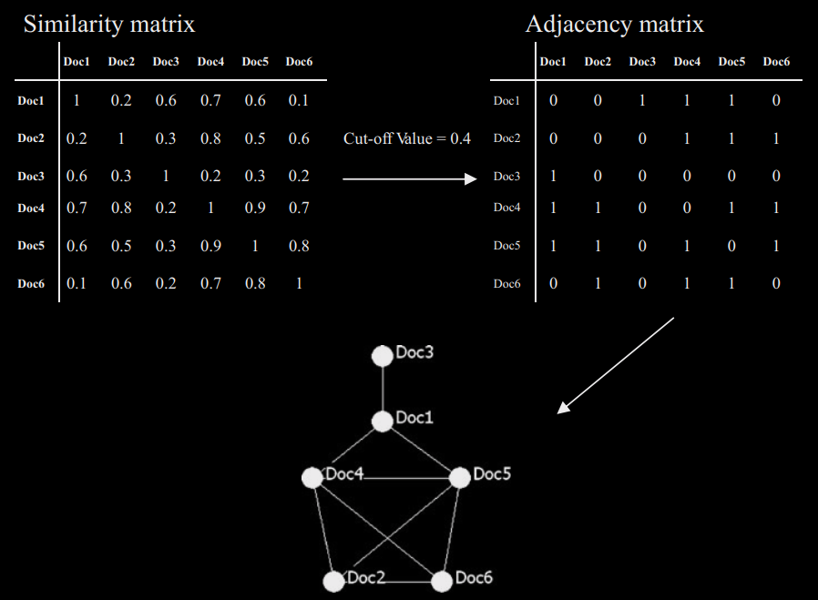

<style>
.title {
  text-align: left;}
body {
text-align: justify;
font-family: Calibri;
font-size: 12pt;}
h1{ /* Header 1 */
  font-size: 28px;}
h1{ /* Header 1 */
  font-size: 26px;}
h2{ /* Header 1 */
  font-size: 22px;}
h3{ /* Header 1 */
  font-size: 18px;}
</style>

```{r setup, include=F}
## Global options
knitr::opts_chunk$set(warning = FALSE, message = FALSE) 
```


## Introduction
Detecting patterns in large complex datasets can prove to be difficult when focusing on single properties. Network analysis is a popular exploratory tool to analyze relationships, dependencies, and patterns in large datasets. Co-occurrence networks are graphs that display nodes as entities that can be connected through edges and can be used in many different domains such as media, biology, and economics. In this tutorial, we will go through how to create a co-occurrence network from an adjacency matrix and various ways to cluster and visualize the network. 

## 1. Creating network
For this tutorial, we will start with a similarity matrix to create the network. A similarity matrix displays the difference between entities, ranging from 0 (no similarity) to 1 (identical). Based on this similarity matrix, a cut-off value can be set to create an adjacency matrix, where rows and columns represent nodes. Values below the cut-off will be set to 0, indicating that no edges should be drawn between entities. Usually, weak connections will be filtered out this way to reduce noise in the network. An **unweighted graph** will set values below the cut-off to 0 and above the cut-off to 1. This is useful if you only care if nodes are connected or not and are not interested in edge information. In a **weighted graph**, a weight is given to each edge. The edge weight can represent various things such as the strength of the relationship between entities. See Figure 1 for a visual overview of creating an unweighted graph. 

{width=600px}

We will create a weighted graph based on a similarity matrix. Edges with a weight below 0.6 will be discarded. The graph will be also simplified, meaning that loop edges and multiple edges will be removed.

```{r input, include = T, message = F}
## Load required libraries
library(tidyverse)
library(igraph)

# Import similarity matrix
matrix <- read.table(file = "data/matrix.txt", header = F)
# Create adjacency graph
adj_graph <- graph.adjacency(as.matrix(matrix), weighted = TRUE, mode = "upper")
# Simplify graph 
graph <- delete.edges(adj_graph, which(E(adj_graph)$weight < 0.6 | E(adj_graph)$weight %in% NA))
graph <- igraph::simplify(graph, remove.multiple = T, remove.loops = T)

# View network size
gorder(graph) # Node count
gsize(graph) # Edge count
```

we have created a network with 613 nodes and 2539 edges. Next, the graph will be converted to a tidygraph object. [Tidygraph](https://tidygraph.data-imaginist.com/) is a tidy framework that allows for easy graph manipulation through dplyr verbs. We will use this functionality later on while adding the clustering information to our graph. 

```{r tidy, include = T, message = F}
library(tidygraph)
tidy_graph <- as_tbl_graph(graph)
tidy_graph
```

## 2. Clustering network
Networks can be clustered to help identify groups and patterns. Clusters represent subsets of entities that have higher co-occurrence within their group than with entities outside the group. We will showcase three clustering methods that can be applied to co-occurrence networks. 

### 2A. Hierarchical clustering
Hierarchical clustering is a method that builds a hierarchy from the bottom-up and doesn’t require a specified amount of clusters beforehand. The **hclust()** function can be used to perform hierarchical cluster analysis. It requires a dissimilarity matrix as input, which can be created with the **dist()** function. 

```{r hierarchical, include = T, message = F}
dist_matrix <- dist(matrix, method = "euclidean")
hc <- hclust(dist_matrix, method = "complete")
```


The created hclust object can be represented as a dendrogram. To define a number of clusters, we can cut the dendogram at a specific height. Cutting the dendrogram at a specific height is a subjective choice that depends on your analysis and goals. The elbow method or silhouette analysis could be used to determine an appropriate height at which to cut the dendrogram. However, visualizing the dendrogram and inspecting it for significant gaps or branches that could represent natural clusters is also a valid approach.

```{r hplot, include = T, message = F}
plot(hc, labels = FALSE, xlab = "", sub = "")
```

We can see at roughly height 7 in the dendrogram the branches split into 5 groups. The cutree() function cuts the dendogram into several groups at a specified height. Once done, we can add the hierarchical clusters to tidygraph object so we can plot them later. 

```{r cutree, include = TRUE, message = FALSE}
hc_clusters <- cutree(hc, h = 7)
```

### 2B. K-means clustering
K-means clustering partitions observations into a predefined number of clusters (K) based on their feature similarities. There are various algorithms available to determine the optimal number of clusters for k-means clustering. For simplicity, we will employ the popular elbow method. The elbow method creates a plot with the number of clusters on the x-axis and the total within sum of squares (WSS) on the y-axis. The location of a bend (elbow) in the plot is an indicator of the appropriate number of clusters, as the total WSS begins to level off.

```{r elbow, include = TRUE, message = FALSE}
library(factoextra)
diag(matrix) <- 1
fviz_nbclust(matrix, kmeans, method = "wss", nstart = 25) +
  geom_vline(xintercept = 4, linetype = 2)+
  labs(subtitle = "Elbow method")
```

The optimal number of clusters according to the elbow method is 4. 

```{r kmeans, include = TRUE, message = FALSE}
set.seed(013)
kclust <- kmeans(matrix, centers = 4, nstart = 25)
```

### 2C. Community detection
The Leiden algorithm is a graph-based method that finds an optimal grouping of nodes into communities. The Leiden algorithm can use **graph modularity** or the **Constant Potts Model (CPM)** to detect communities. Modularity measures the number of edges in a community. High modularity indicates a high number of edges within a community and a low number of edges between nodes in other communities. CPM tries to maximize the number of edges in a community, while simultaneously trying to keep community sizes small. 

We will use the Leiden algorithm with the modularity approach to detect communities. The resolution parameter will be set to 0.5, a higher resolution leads to more smaller communities, while lower a resolution leads to fewer larger communities. Because we have some nodes with no edges in our network, we have to adjust the clustering result. With cluster_leiden(), any node without edges will be classified as a community. This leads to a bunch of single nodes being classified as communities, which will clutter the legend in the final plot. Therefore, we will label all single nodes as "None".

```{r community, include = TRUE, message = FALSE}
# Cluster with Leiden algorithm
leiden <- cluster_leiden(graph, objective_function = "modularity", resolution_parameter = 0.5, n_iterations = 5)
# Get cluster membership for each node
communities <- as.character(leiden$membership)
# Filter all clusters with size 1 
singles <- as.character(leiden$membership[!(duplicated(leiden$membership)|duplicated(leiden$membership, fromLast=TRUE))])
# Group all singular community nodes into one group called "None"
communities <- case_when(communities %in% singles ~ "None", TRUE ~ communities)
```

## 3. Visualizing network
The various clustering results can now be added to the tidygraph object. The tidygraph object can be visualized with the [graph package](https://ggraph.data-imaginist.com/), which is an extension for ggplot that supports relational data structures such as networks, graphs, and trees. Because we store all information in a central tidygraph object, overlaying the various cluster results will be quick and easy.
```{r plot, include = TRUE, message = FALSE}
# Create random node sizes for visual purpose 
sizes <- 0.1 + (3 - 0.1) * (1 - exp(-0.1 * rexp(159)))

# Add all clustering information and node sizes to the tidy object
tidy_graph <- tidy_graph %>%
  activate(nodes) %>%
  mutate(kmeans = kclust$cluster,
         leiden = communities,
         hclust = hc_clusters,
         nodesize = sizes)

# Custom theme for graphs
use_theme <- theme(axis.ticks = element_blank(),
                   axis.title = element_blank(),
                   axis.text = element_blank(),
                   legend.title = element_text(size = 12),
                   legend.text = element_text(size = 10),
                   legend.position = c(0, 0),
                   legend.justification = c("left", "bottom"),
                   legend.background = element_rect(fill='transparent'))
```

Let's plot the network with the k-means clustering as color.

```{r netplot1, include = TRUE, message = FALSE, out.width="100%"}
library(ggraph)

set.seed(16)
ggraph(tidy_graph, layout = 'fr') +
  geom_edge_arc0(width = 0.5, alpha = 0.3, strength = 0.3, color = "black") +
  geom_node_point(aes(fill = as.factor(kmeans), size = nodesize), color = "black", shape = 21) +
  scale_size_continuous(guide = 'none') +
  guides(fill = guide_legend("Kmeans", override.aes = list(size = 5))) +
  scale_fill_brewer(palette = "Paired") +
  theme_light() +
  use_theme
```

Now adjust the plot with hclust as color and change the strength of the geom_edge_arc0() to 0 to create straight edges.

```{r netplot2, include = TRUE, message = FALSE, out.width="100%"}
library(ggraph)

set.seed(16)
ggraph(tidy_graph, layout = 'fr') +
  geom_edge_arc0(width = 0.5, alpha = 0.3, strength = 0, color = "black") +
  geom_node_point(aes(fill = as.factor(hclust), size = nodesize), color = "black", shape = 21) +
  scale_size_continuous(guide = 'none') +
  guides(fill = guide_legend("Hclust", override.aes = list(size = 5))) +
  scale_fill_brewer(palette = "Paired") +
  theme_light() +
  use_theme
```

## 4. Interactive network
Lastly, we will use an interactive network to visualize the community detection network. [VisNetwork](https://datastorm-open.github.io/visNetwork/) is an R package that can be used to interactively explore your network. It requires a node and edge list as input, which we can easily access and manipulate through dplyr verbs.

```{r visnetwork, include = TRUE, message = FALSE, out.width="100%"}
library(visNetwork)
# Extract and manipulate node data
visnodes <- tidy_graph %>%
  activate(nodes) %>%
  data.frame() %>%
  mutate(name = gsub("V", "", name)) %>%
  dplyr::rename(id = name,
                group = leiden,
                value = nodesize) %>%
  select(id, group, value)

# Extract edge data
visedges <- tidy_graph %>%
  activate(edges) %>%
  data.frame()

# Plot interactive network
visNetwork(visnodes, visedges) %>%
  visOptions(
    selectedBy = "group",
    highlightNearest = list(enabled = T, degree = 1),
    nodesIdSelection = TRUE
  ) %>%
  visIgraphLayout(randomSeed = 1)
```

You can zoom in, select nodes or select whole communities. 

## Conclusion
In conclusion, we created an adjacency graph starting from a similarity matrix, we performed 3 different clustering methods and visualized the graph with ggraph and visNetwork. The clustering methods show relatively similar groupings, resulting in either 4 or 5 clusters.

## Package information
```{r info, include = TRUE}
installed.packages()[names(sessionInfo()$otherPkgs), "Version"]
```

### Reference for figure 1
(1)	P. C. Lee, H. N. Su, and T. Y. Chan, “Assessment of ontology-based knowledge network formation by Vector-Space Model,” Scientometrics, vol. 85, no. 3, pp. 689–703, Jul. 2010.

### Author
[Luc van Zon](https://lucvzon.github.io/)